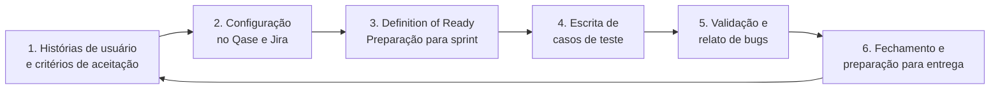
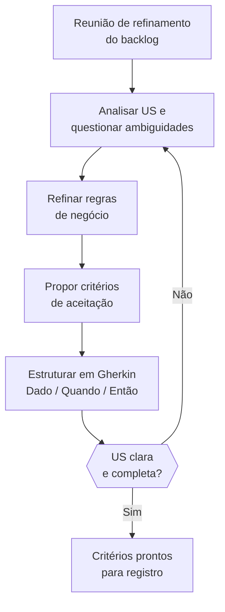
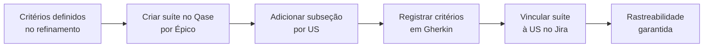
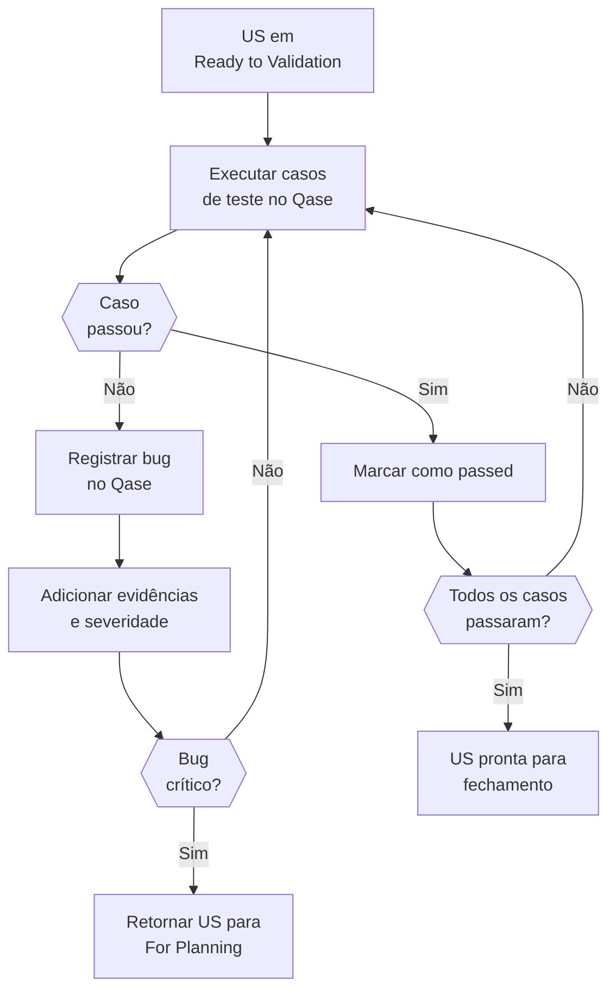
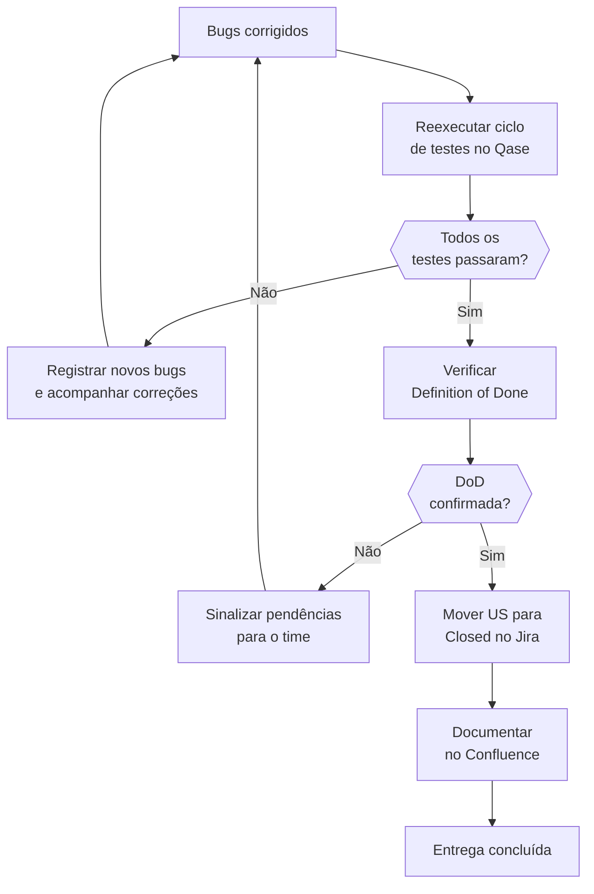

# Fluxo de Trabalho do Analista de Qualidade no Edge

### Um Guia Detalhado para a Equipe de Qualidade

---

## Introdução: A Importância do Analista de Qualidade

Bem-vindos, equipe de qualidade do Centro de Inovações Edge! Este material foi elaborado especialmente para vocês, com o objetivo de apresentar, de forma clara e prática, o nosso fluxo de trabalho, alinhado aos processos e ferramentas utilizados no Edge.

Nosso papel é essencial: garantir que cada funcionalidade entregue seja confiável, funcional e atenda às expectativas dos clientes, contribuindo diretamente para a excelência dos projetos.

### Por que nosso trabalho importa?

No Edge, a qualidade é o pilar que sustenta o desenvolvimento de software. Como Analistas de Qualidade, somos os guardiões da experiência do usuário e da integridade técnica das entregas.

Cada critério de aceitação que definimos, cada teste que executamos e cada bug que reportamos são passos fundamentais para:

- Evitar falhas
- Atender às necessidades do cliente
- Assegurar o sucesso do projeto

Nosso trabalho é a ponte entre o que foi planejado e o que será entregue, garantindo que o produto final seja não apenas funcional, mas excepcional.

---

## Visão Geral do Fluxo

O fluxo de trabalho do QA no Edge é estruturado em **seis etapas principais**, baseadas no "Guia do Analista de Qualidade" e no "Fluxo de Trabalho do Analista de Qualidade":

| #   | Etapa                                                      |
| --- | ---------------------------------------------------------- |
| 1   | Definição de Histórias de Usuário e Critérios de Aceitação |
| 2   | Configuração dos Critérios de Aceitação no Qase e Jira     |
| 3   | Preparação para o Planejamento (Definition of Ready)       |
| 4   | Escrita de Casos de Teste                                  |
| 5   | Validação e Relato de Bugs                                 |
| 6   | Fechamento e Preparação para Entrega                       |



A seguir, vamos mergulhar em cada uma dessas etapas, detalhando o que fazer, como fazer e por que isso é importante, com exemplos práticos para trazer clareza ao processo.

---

## Etapa 1: Definição de Histórias de Usuário e Critérios de Aceitação

### O que acontece aqui?

Tudo começa com a criação de **Épicos** e das **Histórias de Usuário (US)**, que são a base do desenvolvimento ágil no Edge.

- **Épicos** representam grandes objetivos ou funcionalidades que serão desmembrados em histórias menores.
- **Histórias de Usuário** detalham as necessidades específicas dos usuários, seguindo o formato **3W**: _"Como [persona], quero [objetivo], para que [benefício]"_.

Esse padrão ajuda a manter o foco no valor entregue ao usuário e garante que todas as partes envolvidas compreendam claramente o propósito da tarefa.

Depois de escrita a US, o QA entra em ação para definir os **Critérios de Aceitação** — condições testáveis e objetivas que determinam se a história foi concluída com sucesso.

> **Exemplo de História de Usuário:** "Como gerente de projetos, quero criar e atribuir tarefas aos membros da equipe, para que eu possa monitorar o progresso do projeto de forma eficaz." _(US-456)_

### Seu papel

Nessa etapa, você participa das reuniões de refinamento do backlog, colaborando com o Gerente de Projetos (PM), UX Designers e Desenvolvedores. Seu objetivo é garantir que a US seja clara, com regras de negócios, e que os critérios de aceitação sejam objetivos, utilizando o **formato Gherkin** (Dado, Quando, Então).

### Como fazer na prática

Durante o refinamento:

- Analise a US e questione ambiguidades (ex.: _"O que acontece se o título estiver vazio?"_).
- Ajude a refinar regras de negócios e garanta que estejam bem escritas.
- Proponha critérios de aceitação que cubram os cenários principais.
- Escreva os critérios no formato Gherkin, garantindo que sejam testáveis.

**Exemplo prático para a US-456:**

```gherkin
Critério 1 — Cenário: Exibir lista de tarefa do Projeto
  Dado que estou logado como gerente de projetos,
  E estou na tela de criação de tarefas,
  Quando eu preencher o título "Reunião", a descrição "Planejar sprint"
    e selecionar "João" como responsável,
  E clicar em "Criar Tarefa",
  Então a tarefa deve ser registrada com os dados fornecidos,
  E exibida na lista de tarefas do projeto.

Critério 2 — Cenário: Tarefa cadastrada deve aparecer no painel do Gerente
  Dado que a tarefa foi criada com um responsável atribuído,
  Quando a criação for concluída com sucesso,
  Então o responsável "João" deve receber uma notificação automática,
  E a tarefa deve aparecer no painel dele.
```

### Por que é importante?

Critérios bem definidos:

- Alinham as expectativas do time e do cliente.
- Reduzem o risco de mal-entendidos.
- Servem como base para os testes futuros.
- Sem clareza, o retrabalho aumenta e a entrega pode não atender ao esperado.

> **💡 Dica prática:** Participe ativamente do processo de refinamento: converse com o designer para alinhar expectativas visuais e funcionais, dialogue com o desenvolvedor para garantir viabilidade técnica, defina regras claras junto ao time e ao cliente para evitar ambiguidades, e solicite exemplos concretos que possam servir como referência. Certifique-se de que os critérios estabelecidos sejam realistas, abrangentes e aplicáveis ao contexto do projeto, promovendo uma colaboração eficiente entre todos os envolvidos.



---

## Etapa 2: Configuração dos Critérios de Aceitação no Qase e Jira

### O que você faz aqui?

Depois de definir os critérios no refinamento, você os formaliza nas ferramentas do Edge: **Qase** (para gestão de testes) e **Jira** (para rastreamento de tarefas).

### Passo a passo

**1. No Qase:**

- Acesse o repositório de testes e clique em "Nova Suíte".
- Crie uma suíte com o nome do Épico correspondente no Jira (ex.: EP1: "Gestão de Tarefas").
- Dentro da suíte, adicione uma subseção para a US específica, como `[US-456] – Cadastro de Pessoas`.
- Registre cada critério como um item, usando títulos curtos e o Gherkin nos detalhes.

**Estrutura do Qase:**

```
Qase
└── Repositório de Testes
    └── Suíte: [EP1] Gestão de Tarefas
        └── [US-456] – Cadastro de Pessoas
            └── AC – Critérios de Aceitação
                ├── Critério 1: Campos obrigatórios preenchidos
                ├── Critério 2: Validação de e-mail
                └── Critério 3: Confirmação de cadastro
```

**2. No Jira:**

- Abra a US correspondente (US-456).
- Na seção "Qase" ou "Links", insira o URL da suíte criada, conectando as duas ferramentas.

**Exemplo prático para a US-456:**

```
Suíte no Qase: "Gestão de Tarefas > [US-456] – Critérios de Aceitação"

Item 1: "[US-456] – Critério 1: Criar tarefa com dados válidos"
  Dado que estou logado como gerente de projetos,
  E estou na tela de criação de tarefas,
  Quando eu preencher o título "Reunião", descrição "Planejar sprint"
    e selecionar "João",
  E clicar em "Criar Tarefa",
  Então a tarefa deve ser registrada,
  E exibida na lista de tarefas.

Item 2: "[US-456] – Critério 2: Notificar responsável"
  Dado que a tarefa foi criada com "João" como responsável,
  Quando a criação for concluída,
  Então "João" deve receber uma notificação,
  E a tarefa deve aparecer no painel dele.

No Jira: Adicione o link da suíte à US-456 na coluna "Qase".
```

### Por que isso importa?

- **Rastreabilidade:** Todos sabem onde encontrar os critérios e o que será testado.
- **Organização:** As ferramentas centralizam as informações, evitando perda de dados.
- **Colaboração:** Desenvolvedores e QAs têm acesso ao mesmo material, alinhando o trabalho.

> **💡 Dica prática:** Use títulos objetivos nos itens do Qase (ex.: "Criar tarefa com dados válidos") e deixe os detalhes no Gherkin. Isso facilita a leitura e a manutenção.



---

## Etapa 3: Preparação para o Planejamento (Definition of Ready)

### O que é a Definition of Ready (DoR)?

A DoR é uma **checklist** que a US deve cumprir antes de ser incluída em uma sprint. No Edge, ela inclui:

- [ ] Descrição detalhada da US com regras de negócio.
- [ ] Protótipos de alta fidelidade validados pelo UX.
- [ ] Critérios de aceitação definidos e registrados no Qase.

### Seu papel

Você verifica se a US atende à DoR:

- **Aprovada:** A US é movida para a coluna "For Planning" no Jira.
- **Pendências:** Você sinaliza ao time para ajustes antes de avançar.

**Exemplo prático para a US-456:**

- **Descrição:** "Criar e atribuir tarefas para monitoramento de projetos."
- **Protótipo:** Tela de criação validada pelo UX (disponível no Figma).
- **Critérios:** Dois critérios registrados no Qase (como mostrado na Etapa 2).
- **Regra de Negócio:** Regra bem definida com os envolvidos.
- **Resultado:** US aprovada e movida para "For Planning".

### Por que é essencial?

- Evita que histórias mal definidas entrem na sprint, reduzindo retrabalho.
- Garante que o time tenha tudo o que precisa para começar (requisitos, protótipos, critérios).
- Economiza tempo ao antecipar problemas antes do desenvolvimento.

> **💡 Dica prática:** Faça a checagem da DoR em conjunto com o PM e o UX durante o refinamento. Isso agiliza o processo e resolve pendências na hora.

---

## Etapa 4: Escrita de Casos de Teste

### O que são casos de teste?

São instruções detalhadas que validam os critérios de aceitação, incluindo passos específicos, dados de entrada e resultados esperados. Eles são criados no Qase **enquanto os desenvolvedores implementam a US**, cobrindo:

- **Cenários positivos** (sucesso)
- **Cenários negativos** (falhas)

### Como fazer isso?

1. Use a mesma suíte da US no Qase (ex.: `[US-456] – Critérios de Aceitação`).
2. Crie casos de teste com títulos no formato: `[ID da US] – Caso XX: [Ação ou Fluxo Testado]`.
3. Detalhe os passos em Gherkin, incluindo cenários variados.

**Estrutura do Qase com casos de teste:**

```
Qase
└── Repositório de Testes
    └── Suíte: [EP1] Gestão de Tarefas
        └── [US-456] – Cadastro de Pessoas
            ├── AC – Critérios de Aceitação
            │   ├── Critério 1: Campos obrigatórios preenchidos
            │   ├── Critério 2: Validação de e-mail
            │   └── Critério 3: Confirmação de cadastro
            └── TC – Casos de Teste
                ├── TC 01: Criar tarefa com dados válidos
                ├── TC 02: Tentar criar tarefa sem título
                ├── TC 03: Inserir e-mail inválido e tentar salvar
                └── TC 04: Verificar mensagem de sucesso após cadastro
```

**Exemplos detalhados para a US-456:**

```gherkin
# [US-456] – Caso 01: Criar tarefa com dados válidos
Dado que estou logado como gerente de projetos,
E estou na tela de criação de tarefas,
Quando eu preencher o título "Reunião", descrição "Planejar sprint"
  e selecionar "João" como responsável,
E clicar em "Criar Tarefa",
Então a tarefa "Reunião" deve aparecer na lista de tarefas do projeto.

# [US-456] – Caso 02: Tentar criar tarefa sem título
Dado que estou logado como gerente de projetos,
E estou na tela de criação de tarefas,
Quando eu deixar o título em branco, preencher a descrição "Planejar sprint"
  e selecionar "João",
E clicar em "Criar Tarefa",
Então o sistema deve exibir a mensagem "Título é obrigatório",
E a tarefa não deve ser criada.
```

### Por que isso é necessário?

- **Cobertura completa:** Garante que todos os cenários (esperados e exceções) sejam testados.
- **Consistência:** Oferece um guia claro para qualquer QA executar os testes.
- **Prevenção:** Identifica falhas potenciais antes da validação formal.

> **💡 Dica prática:** Escreva os casos em paralelo ao desenvolvimento e revise-os com o time para alinhar expectativas. Isso evita surpresas na validação.

---

## Etapa 5: Validação e Relato de Bugs

### O que acontece aqui?

Quando a US é movida para **"Ready to Validation"** no Jira, significa que o desenvolvimento terminou e a funcionalidade está pronta para teste no ambiente de homologação (UAT) ou desenvolvimento. Você executa os casos de teste e valida se a US atende aos critérios.

### Seu papel

**1. Executar os testes:** No Qase, abra o plano de teste da US e marque cada caso como "passou" ou "falhou".

**2. Reportar bugs:** Se algo falhar, registre o problema no Qase com:

- Passo a passo para reproduzir.
- Evidências (prints, vídeos, logs).
- Severidade (ex.: alta, bloqueante).
- _Os bugs são sincronizados automaticamente com o Jira._

**3. Avaliar maturidade:** Se houver bugs críticos, retorne a US para "For Planning".

**Exemplo prático — Bug para a US-456:**

```
Título: "Tarefa criada não é exibida na lista"

Passos para reproduzir:
  1. Acesse a tela de criação de tarefas.
  2. Preencha título "Teste", descrição "Exemplo" e responsável "Maria".
  3. Clique em "Criar Tarefa".
  4. Verifique a lista de tarefas.

Resultado obtido: Tarefa não aparece.
Evidência: Print da lista vazia.
Severidade: Alta.
```

### Por que isso é crucial?

- Confirma que a US funciona como esperado.
- Identifica falhas antes da entrega, protegendo a experiência do usuário.
- Garante que a funcionalidade está madura para testes mais complexos (ex.: integração).

> **💡 Dica prática:** Seja detalhista nos bugs: descreva o esperado, o encontrado e inclua evidências claras. Faça _pair testing_ com o desenvolvedor para antecipar problemas.



---

## Etapa 6: Fechamento e Preparação para Entrega

### O que você faz aqui?

Após as correções dos bugs, você reexecuta os testes no Qase. Se todos passarem e não houver bugs críticos, a US é considerada concluída e pronta para entrega. Você formaliza o fechamento no Jira e documenta o processo.

### Passo a passo

1. **Criar e executar o ciclo de testes:** Monte um plano no Qase e valide todos os casos.
2. **Abrir bugs (se necessário):** Registre falhas e acompanhe as correções.
3. **Estabilizar a US:** Reteste até que tudo esteja resolvido.
4. **Confirmar a Definition of Done (DoD):** Verifique:
   - [ ] Funcionalidade implementada.
   - [ ] Testes bem-sucedidos.
   - [ ] Código revisado.
   - [ ] Documentação atualizada no Confluence.
5. **Fechar a US:** Mova para "Closed" no Jira e finalize o plano no Qase.

**Exemplo prático para a US-456:**

- Ciclo de testes executado: Caso 01 e Caso 02 passam após correção do bug "tarefa não exibida".
- DoD confirmada: Funcionalidade ok, testes ok, documentação no Confluence.
- US movida para "Closed" no Jira.
- Relatório no Confluence: _"US-456 validada em 10/10/2023, 2 bugs corrigidos."_

### Por que isso importa?

- Garante que a US está estável e pronta para o cliente.
- Formaliza a entrega com rastreabilidade e qualidade.
- Constrói confiança no processo e no produto final.

> **💡 Dica prática:** Documente tudo no Confluence de forma detalhada: registre os testes executados (objetivos, passos e resultados), o status completo do ciclo (aprovados e reprovados), os bugs encontrados (impacto, ações e resultado) e o status geral do projeto. Essa abordagem é essencial para auditorias, retrospectivas e rastreabilidade.



---

## Ferramentas e Boas Práticas

### Ferramentas

| Ferramenta     | Uso principal                             |
| -------------- | ----------------------------------------- |
| **Qase**       | Suítes, casos de teste, planos e execução |
| **Jira**       | Gestão de US e bugs                       |
| **Confluence** | Documentação e relatórios                 |

### Boas Práticas

- ✅ Esteja presente no refinamento desde o início.
- ✅ Mantenha o Qase sempre atualizado.
- ✅ Garanta rastreabilidade entre US, testes e bugs.
- ✅ Seja claro e detalhado na documentação.
- ✅ Participe das cerimônias (planning, review, retrospectiva).

---

## Conclusão

Com este guia detalhado, a equipe tem em mãos o mapa completo para atuar como QAs no Edge, garantindo excelência em cada etapa do processo.

Desde a definição e refinamento das histórias, passando pela elaboração de critérios de aceitação claros e testes rigorosos, até o fechamento e validação final, cada passo foi cuidadosamente pensado para assegurar **qualidade**, **colaboração** e **alinhamento** com os objetivos do projeto.

Vamos juntos construir soluções incríveis que não apenas encantem nossos clientes, mas também fortaleçam nossa reputação como Centro de Inovações, destacando-nos no mercado.

---

_Alguma dúvida ou sugestão? Vamos continuar aprimorando nosso trabalho em equipe!_
